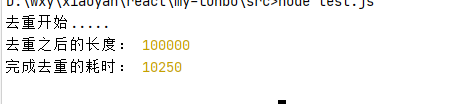
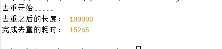
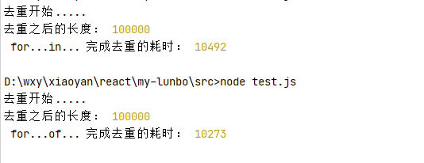
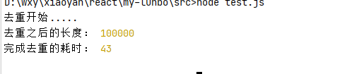
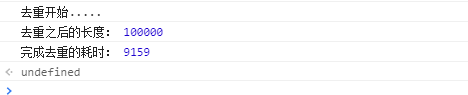
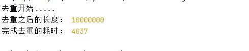
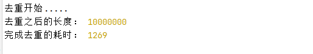

只要是个程序猿，都不可避免的要接触数组去重，去重的方法多种多样，那哪一个才是高效的去重方案呢？下面是针对几种方法去测试一下它们的性能。

先写一个计算去重时间的耗时方法

```
const removeDuplicate = (fun) => {
  //创建一个length：100000 的数组
  const _arr1 = Array.from(new Array(100000), (val, index) => index);
  //创建一个length：60000 的数组
  const _arr2 = Array.from(new Array(60000), (val, index) => index);
  // 合并俩个数组，制造重复项
  const mergeArr = _arr1.concat(_arr2);
  //开始去重之前的开始时间
  const startTime = new Date().getTime();
  console.log("去重开始.....");
  const successArr = fun(mergeArr);
  //去重完成时的时间
  const endTime = new Date().getTime();
  console.log("去重之后的长度：", successArr.length);
  console.log("完成去重的耗时：", endTime - startTime);
}
```

**Array.prototype.filter + indexOf 完成去重**

```
removeDuplicate((arr) => {
  return arr.filter((val, index) => {
    //indexOf()方法返回在数组中可以找到一个给定元素的第一个索引，如果不存在，则返回-1。
    return arr.indexOf(val) === index;
  });
});
```



**双重for循环去重**

```
removeDuplicate((arr) => {
  for (let i = 0, len = arr.length; i < len; i++) {
    for (let j = i + 1; j < len; j++) {
       if (arr[i] == arr[j]) {
        arr.splice(j, 1);
        //len-1 是因为splice会改变原数组，作删除操作
        len--;
        //j-1  因为在索引位进行删除，j如若不减1，会直接调 1——>3，直接跳过一个空档。当有[0, 1, 2,0,0,1,1]就会有残留
        j--;
      }
      }
  }
  return arr;
});
```



**for...of...（for...in...）  + includes 完成去重。**

```
removeDuplicate((arr) => {
  const newArr = [];
  for (let i in arr) {
    if (!newArr.includes(arr[i])) {
      newArr.push(arr[i])
    }
  }
   // for (let val of arr) {
  //   if (!newArr.includes(val)) {
  //     newArr.push(val)
  //   }
  // }
  return newArr
});
```



**利用Array.prototype.sort()进行排序，之后比较相邻的俩个元素是否相等**

```
removeDuplicate((arr) => {
  const newArr = [];
  arr.sort();
  for (let i = 0, len = arr.length; i < len; i++) {
    arr[i] !== arr[i + 1] && newArr.push(arr[i])
  }
  return newArr
});
```



**利用reduce + indexOf完成去重**

```
const _arr = [];
const reduceFunc = (acc, cur) => {
  if(_arr.indexOf(cur) === -1){
    _arr.push(cur);
  }
  return _arr;
};
removeDuplicate((arr) => {
  return arr.reduce(reduceFunc, []);
})
```



*为了更明显区分以下俩种去重效率（数据太小差别不大），arr1.lenngth改为10000000，arr2.lenngth改为6000000，以下俩种方法都比上面的方法快*

**利用 Set去重，Set 中的值总是唯一的**

```
removeDuplicate((arr) => {
  //使用Array.from 是因为 new Set(arr) 生成的是一个类数组
  return Array.from(new Set(arr));
});
```



**利用对象的属性名是唯一性的这个特点去重数组**

```
removeDuplicate((arr) => {
  let obj = {};
  const newArr = [];
  for (let val of arr) {
    //属性值无赋值时为undefined
    if (!obj[val]) {
      obj[val] = 1;
      newArr.push(val);
    }
  }
  obj = null;
  return newArr;
});
```

