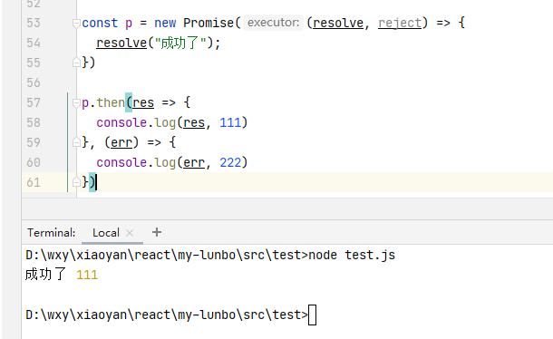

说到Promise，它也是面试中的常客，经常听到会有：

- Promise解决了什么问题？业界内有什么实现吗？
- Promise的API有哪一些？
- 能不能手写一个符合Promise/A+规范的Promise？
- .....

**为何会出现Promise？**

在处理多个异步请求当中，没出现Promise我们是这么用的：

```
fs.readFile("./test1.js", "utf-8", (error, data) => {
  fs.readFile(data, "utf-8", (error, data) => {
    fs.readFile(data, "utf-8", (error, data) => {
      console.log(data);
      //可能存在更多的嵌套.....
    })
  })
})
```
你仔细瞅瞅，再仔细品品，层层嵌套，如果还要对请求的结果进行进一步处理，那么多代码存放在嵌套里面，很耗费精力跟时间去阅读与解析，也很难维护！有没有感到中午可以再吃俩碗饭补充能量？**遗臭万年的回调地狱就这么来的**。产生回调地狱的原因：

- 层层嵌套的调用，上一个成功的回调往往作为下一个函数的输入。
- 处理多个异步请求，开发时往往需要同步请求得到最终结果

然而出现的Promise为我们解决了回调地狱的痛点，以一种更加友好，便于阅读理解的方式去组织代码。上面的代码通过Promise改造：

```
const result = (filePath) => {
  return new Promise(((resolve, reject) => {
    fs.readFile(filePath, "utf-8", (err, data) => {
      if (err) {
        reject(err);
      } else {
        resolve(data)
      }
    })
  }))
}

result("./test1.js").then((data) => {
  return result(data)
}).then(data => {
  return result(data)
}).then(data => {
  console.log(data)
}, err => {
  console.log("错撩~~", err)
});
```

上面的代码看起来是不是美观让人舒服很多？Promise为我们除去臃肿的代码，通过then方法采用链式调用的方式，增加了可维护性和阅读性。**也就是说，Promise为我们解决了异步编码的风格问题。**那Promise业界内的实现有哪些呢？比较著名的有：**bluebird（bluebird 甚至号称运行最快的类库），Q，ES6-Promise**。

#### 手写Promise

先来分析promise的基本特征：


promise有三种状态：**Pending**（待办的、在等待...），**Fulfilled**（resolve,完成，解决），**Rejected**（失败），Promise只能Pendind到Fulfilled，或者Pending到Rejected，状态一旦确定就不可以改变，默认状态为Pending；

- new Promise时需要传一个executor()执行器，并且立即执行；
- executor()接收俩个参数，分别是resolve和reject；
- promise 用一个 value保存成功状态时候的值，可以是undefined、promise、thenable，用一个reason保存状态失败的值；
- 一个promise必须提供一个then方法访问其当前的value（最终值，成功的回调）和reason（原因，失败的回调），该方法接收俩个参数，promise.then(onFulilled,onRejected)；
- 调用then时，如果promise已经成功，则执行onFulFilled，参数时promise的value，如若失败则执行onReject，参数为promise的reason
- then如果抛出了异常，那么这个异常就会作为参数，传递给下一个then的失败回调onRejected。

根据以上特征先编写初步代码：

```
const PENDING = "PENDING";
const FULFILLED = "FULFILLED";
const REJECTED = "REJECTED";

class Promise {
  //executor是一个双参函数，参数为resolve和reject。Promise的实现会立即执行executor
  constructor(executor) {
    //保存成功时的值
    this.value = undefined;
    //保存失败时候的值
    this.reason = undefined;
    //状态值,默认为pending
    this.status = PENDING;
    //成功时调用
    const resolve = (value) => {
      // 状态为pending才进入，防止executor调用调用reject之后再调用resolve
      if (this.status === PENDING) {
        this.status = FULFILLED;
        this.value = value;
      }
    }
    //失败时调用
    const reject = (value) => {
      //状态为pending才进入，防止executor调用resolve之后再调用reject
      if (this.status === PENDING) {
        this.status = REJECTED;
        this.reason = value;
      }
    }

    try {
      //立即执行
      executor(resolve, reject);
    } catch (err) {
      // 发生异常时，执行拒绝方法
      reject(err);
    }
  }

  //编写then方法
  then(onFulfilled, onRejected) {
    this.status === FULFILLED && onFulfilled(this.value);
    this.status === REJECTED && onRejected(this.reason);
  }
}
```

来测试一下代码

```
const p = new Promise((resolve, reject) => {
  resolve("成功了");
})

p.then(res => {
  console.log(res, 111)
}, (err) => {
  console.log(err, 222)
})
```



一个简单的promise实现啦。是不是觉得到这里就OK了？刚开我也是这么认为的。我们在executor加一个异步函数看看。

```
const p = new Promise((resolve, reject) => {
  setTimeout(() => {
    resolve("成功了...")
  }, 0);
})
```

我们发现，调用了then方法，但是却没有返回。原因在于promise调用then方法时没有成功/失败，一直处于pending状态。在这里我们需要将成功和失败的回调存储起来，在executor中异步函数被执行时，触发resolve和reject。因此有如下的更改：

```
class Promise {
  //executor是一个双参函数，参数为resolve和reject。Promise的实现会立即执行executor
  constructor(executor) {
    ......
    //存储成功时回调
    this.successCallBack = [];
    //存储失败时的回调
    this.failCallBack = [];
    //成功时调用
    const resolve = (value) => {
      // 状态为pending才进入，防止executor调用调用reject之后再调用resolve
      if (this.status === PENDING) {
        ......
        this.successCallBack.forEach(fn => fn());
      }
    }
    //失败时调用
    const reject = (value) => {
      //状态为pending才进入，防止executor调用resolve之后再调用reject
      if (this.status === PENDING) {
       ......
       this.failCallBack.forEach(fn => fn());
      }
    }

   ......
  }

  //编写then方法
  then(onFulfilled, onRejected) {
    ......
    if (this.status === PENDING) {
      //如果状态是pending时，把成功、失败的回调存起来
      this.successCallBack.push(() => onFulfilled(this.value));
      this.failCallBack.push(() => onRejected(this.reason));
    }
  }
}
```

到此，异步问题的处理暂时告一段落撩~


**解决链式调用**

- then中的参数onFulfilled，onRejected可以缺省，如果onFulfilled，onRejected如果不是函数，将其忽略，且依旧可以在下面获取之前它返回的值。
- promise.then可以执行多次，每次执行完then方法之后都会返回一个新的promise。

```
const resolvePromise = (promise2, x, resolve, reject) => {
  if (promise2 === x) {
    return reject(new TypeError('Chaining cycle detected for promise #promise'))
  }
  // 加一个开关，防止调用了resolve之后再调用reject （同时调用resolve，reject）
  let called = null;
  if ((typeof x === 'object' && x !== null) || typeof x === 'function') {
    try {
      //
      let then = x.then;
      if (typeof then === 'function') {
        then.call(x, y => {
          if (called) return;
          called = true;
          //递归解析过程，promise里面还会存在promise的情况
          resolvePromise(promise2, y, resolve, reject)
        }, r => {
          //失败情况
          if (called) return;
          called = true;
          reject(r)
        })
      } else {
        //如果then是一个普通值，直接返回结果
        resolve(x);
      }
    } catch (error) {
      if (called) return;
      called = true;
      reject(error);
    }
  } else {
    //直接把上一步的传值返回去（为空的情况）
    resolve(x);
  }
}

  //编写then方法
  then(onFulfilled, onRejected) {
    // onFulfilled,onRejected 传值为空的情况
    onFulfilled = typeof onFulfilled === 'function' ? onFulfilled : v => v;
    onRejected = typeof onRejected === 'function' ? onRejected : err => {
      throw err;
    };
    // 每调用一次都新创建一个promise
    let promise2 = new Promise((resolve, reject) => {
      if (this.status === FULFILLED) {
        setTimeout(() => {
          try {
            let x = onFulfilled(this.value);
            console.log(promise2, x, 6666, resolve)
            resolvePromise(promise2, x, resolve, reject);
          } catch (e) {
            reject(e);
          }
        }, 0)
      }
      if (this.status === REJECTED) {
        setTimeout(() => {
          try {
            let x = onRejected(this.reason);
            resolvePromise(promise2, x, resolve, reject);
          } catch (e) {
            reject(e);
          }
        }, 0)
      }
      if (this.status === PENDING) {
        this.successCallBack.push(() => {
          setTimeout(() => {
            try {
              let x = onFulfilled(this.value);
              resolvePromise(promise2, x, resolve, reject);
            } catch (e) {
              reject(e);
            }
          }, 0)
        });
        this.failCallBack.push(() => {
          setTimeout(() => {
            try {
              let x = onRejected(this.reason);
              resolvePromise(promise2, x, resolve, reject);
            } catch (e) {
              reject(e)
            }
          }, 0)
        });
      }
    });
    return promise2;
  }
}
```

测试结果：

```
const p = new Promise((resolve, reject) => {
  setTimeout(() => {
    resolve(()=>{
      console.log('success')
    })
  }, 0);
})
p.then().then().then(res => {
  console.log(res(), 1);
}, err => {
  console.log(err(), 2);
})
```

