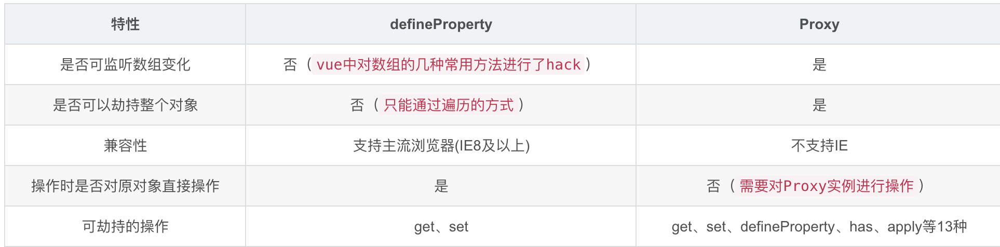

# **vue3入门**

1. **响应式原理差异。**  Object.defindproperty() -> Proxy ()， 提升defindProperty遍历响应式数据以及数组hack的效率，优化性能。  后续的依赖收集、发布订阅基本一致

```
// obj 为被代理对象
const obj = {
  name: '蓝忘机'
}
new Proxy(obj, {
  get(target, p, receiver) {
    return Reflect.get(target, p);
  },
  //改变值和设置新值都调用set方法
  set(target, p, value, receiver) {
    Reflect.set(target, p, value);
  },
  deleteProperty(target, p) {
    return Reflect.deleteProperty(target, p);
  }
});
```

​                         

1. **虚拟dom对比算法。**  对纯文本dom跳过对比，直接渲染。  优化性能
2. **v-model。** 从:value, emit('input')的语法糖。改成 :modelValue, emit('update:modelValue')的语法糖。
3. 生命周期

destory变unmount

```
setup(){
		/*
    * beforeCreate(){} , create(){} 没有对应的组合式API
    *  setup 是围绕 beforeCreate 和 created 生命周期钩子运行的，
    * 所以不需要显式地定义它们。换句话说，
    * 在这些钩子中编写的任何代码都应该直接在 setup 函数中编写。
    * 优先级：setup > beforeCreate > create
    * */
    //在setup中使用都加上on变成小驼峰名字
     onBeforeMount,onMounted,
     onBeforeUpdate,onUpdated,
     onBeforeUnmount: 由beforeDestroy改变名字
     onUnmounted: 由destroy改变名字
}
```


1. **composition api**

   		1） **逻辑内聚**

针对业务逻辑的归纳，抛弃option api的逻辑分散，避免文件过大时调用疯狂跳转。

 2）**setup**

在created前调用，并收集依赖，此时vue未实例化，this未创建。所以vue2.x中的this.props, this.$emit(), this.$nextTick, this.$store, this.$router等等在实例原型链上的钩子或者方法都不能通过this去调用。

**this.$emit()  vue3 替换写法 **

 ```
 通过setup第二个参数结构emit来使用
 ```

**this.$nextTick vue3 替换写法 **

```
import {nextTick} from 'vue';
通过引入来使用，使用方式与vue2一致
```

**this.$store  vue3 替换写法**

```
import {useStore} from 'vuex';
setup(){
    const store = useStore();
		store.dispatch(...);
		store.commit(...);
}
```

**this.$router，this.$route**

```
import {useRoute, useRouter} from 'vue-router';
setup(){
  /*
  route   用于获取当前路由数据
  router  用于路由跳转
  */
  const route = useRoute();
  const router = useRouter();
}
```

当然，没有this也不会有this.data, this.methods等。 

setup()的return值会直接绑定在vue实例上。 类似this.data, this.methods。

```
  /*
  setup接受俩个参数，一个是props,第二个是个普通的js对象，暴露三个property
  attrs,slots,emit
  */
  
  //emit使用
  //子组件
  setup(props, {attrs, slots, emit}) {
    const addCount = () => {
      emit('addCount', {value: '343452'});
    }
    return {
      addCount
    }
  }
  
  //父组件
  <Test @addCount="addCount" />
  
  setup() {
    const count = ref(0)
    const addCount = ({value}) => {
      count.value++;
      console.log(value)
    }
    return {
      addCount
    }
  }
```

**computed vue3使用**

```
<template>
  <h2>个人信息</h2>
  第一个：<input v-model="person.firstName">
  <br>
  第二个：<input v-model="person.endName">
  <br>
  修改CP名称：<input v-model="person.fullName">
  <p>魔道祖师CP：{{ person.fullName }}</p>
</template>

setup() {
    const person = reactive({
      firstName: '蓝忘机',
      endName: '魏无羡'
    });
    //简单获取计算属性，不考虑改变的时候
    person.fullName = computed(() => {
      return person.firstName + '--' + person.endName
    });
    //计算属性值可更改的时候
    person.fullName = computed({
      get() {
        return person.firstName + "--" + person.endName;
      },
      set(value) {
        const nameArr = value.split('--');
        person.firstName = nameArr[0];
        person.endName = nameArr[1];
      }
    })
    return {
      person
    }
  }
```

**watch vue3使用**

```
    const person = reactive({
    	firstName:'蓝忘机',
    	endName:'魏无羡',
    	job:{
    		j1:{
    			jobName:'中国打工人'
    		}
    	}
    })
    
		/*
    * watch(监听对象，fn,{...配置（immediate）})
    * */
 _________________________________(ref)

    //监听 ref 定义的数据
    watch(count, (newVal, oldVal) => {
      console.log(newVal, oldVal);
    }, {immediate: true});
    //监听多个 ref 定义的数据
    watch([count, age], (newVal, oldVal) => {
      console.log(newVal, oldVal);
    });
    
    //当使用ref定义一个对象的时候，以下俩种写法才能实现监听
    watch(person.value, (newVal, oldVal) => {
      console.log(newVal, oldVal);
    })
    watch(person, (newVal, oldVal) => {
      console.log(newVal, oldVal);
    }, {deep: true})
___________________________________________(reactive)
    /*
    * 鉴定 reactive 定义的数据
    * 值得主意的点：
    * 1、监听reactive定义的数据，无法正确获取oldVal，也就是newVal和old变化相同
    * 2、强制开启了深度监视，即deep配置无效
    * */
    watch(person, (newVal, oldVal) => {
      console.log(newVal, oldVal);
    });
    //监听reactive对象定义的单个属性变化
    watch([() => person.firstName, () => person.endName], (newVal, oldVal) => {
      console.log(newVal, oldVal)
    });
    
  **********************************
    /*
    * 特殊情况
    * 监听reactive定义的数据里面的某些个属性对象时，deep设置有效
    * */
    <button @click="person.job.j1.jobName = "中国繁荣昌盛"/>

    watch(() => person.job, (newVal, oldVal) => {
      console.log(newVal, oldVal);
    }, {deep: true})
    
    
```

**watchEffect  **

```
//方法内部用到的依赖改变了，就会重新走一遍里面的逻辑
const obj = reactive({
      name: 1
    });
    const getData = () => {
      obj.name = 100;
    }
    watchEffect(() => {
      console.log("------", obj.name)
});  //默认开启immediate:true
```

**toRef**

```
用来为源响应式对象上的 property 性创建一个 ref。
语法： const name = toRef(person,'name');
应用：要将响应式对象中的某个属性单独提供给外部使用时

扩张：toRefs与toRef功能一致，但可以批量创建多个Ref对象。
语法：toRefs(person)
```

**shallowReactive** 和 **shallowRef**

```
shallowReactive: 只处理对象最外层的响应式
const person = shallowReactive({
      name: '蓝忘机',  //只对第一层做响应式
      info:{ //无响应式
        age:18,
        home:{
          address:'中国大陆'
        }
      }
    });
shallowRef: 只处理基本数据类型的响应式，不进行对象的响应式处理（传入一个Object，不管第几层都无响应式）
使用场景：
1、如果有一个对象，结构比较深，但变化的只是外层属性，则使用：shallowReactive
2、如果有一个对象，后续不会修改该对象属性，而是生成新的对象来替换，则使用：shallowRef
	
	const person = shallowRef({name:'魏无羡'}); //改变name无响应式
	person = {name:'蓝忘机'};  //生成新对象来替换实现响应式，此时是对person做响应式处理
```

**readonly 和 shallowReadonly**

```
readonly:使一个响应式对象数据变为深只读
shallowReadonly: 使一个响应式对象变为浅只读，对第一层对象数据不可读，嵌套对象不受影响
语法：readonly(reactive({...}))
使用场景：当使用他人数据，并且传入的数据不希望被修改时
```

**toRaw 和 markRaw**

```
toRaw: 将一个由reactive定义的响应式对象转为普通对象
使用场景：用于读取响应式对象对应的普通对象，临时读取而不会引起代理访问/跟踪开销，也可用于写入而不会触发更改。

markRaw:标记一个对象，使其永远不会转换为代理。返回对象本身
语法：person.car = markRaw({name:11}) //car不会作为响应式，但是更改name值会发现数据变化
使用场景：
1、当有一些数据不应作为响应式时，列如第三方类库
2、当渲染列表具有不可变数据源的大列表时，跳过响应式转换可以提高性能。
```

**Teleport**

```
//允许我们控制在 DOM 中哪个父节点下呈现 HTML
// to 的值可以是id（#app） class(.app) 标签名(div)等等~~
<Teleport to='body'>
 <p> 我是teleport的内容</p>
</Teleport>
```


3）**provide/inject   小型stroe**

作用跟eventbus基本一致。 缺点同样也一致。不同点是provied只能自上而下传。

优点： 跨代传递响应式参数的方案之一，可传递类似一个小型store的针对某个功能的内聚的逻辑&方法。

缺点： 依赖不明，在inject的时候并不知道在哪provied，用得太多太散会造成灾难级维护难度。

建议应用场景： 如融合通信组件，跨多组件传递、收集参数、事件。融合通信组件暴露出接口，通过在最顶层provied，每个子组件都能对融合通信组件进行发起、加入、挂断等操作。

```
import {provide} from 'vue';
provide('key', value)
const value = inject('key')
```


1. hooks

mixin升级版。 对公共逻辑进行抽象封装。 

**minix升级版**

```
通过使用useXXX这种方式进行定义，通过导入的方式获取，有效的解决了命名冲突问题
//*****useWH.js********
import {onMounted, onUnmounted, reactive} from "vue";

export default () => {
  const windWH = reactive({
    width: 0,
    height: 0
  });
  const getWH = () => {
    console.log('window.innerWidth:', window.innerWidth)
    console.log('window.innerHeight:', window.innerHeight)
    windWH.width = window.innerWidth;
    windWH.height = window.innerHeight;
  };
  const printInfo = (value) => {
    console.log('定义的方法被输出了:', value);
  }
  onMounted(() => {
    window.addEventListener('click', getWH)
  });
  onUnmounted(() => {
    window.removeEventListener('click', getWH)
  })
  return {
    windWH,
    printInfo
  }
}

// ******App.vue*****
import useWH from "./hock/useWH";

export default {
  name: 'App',
  setup() {
    const {printInfo, windWH} = useWH(); //显示结构return的对象值，有效避免命名冲突
    const getData = () => {
      printInfo('打工人打工魂');
      console.log('windWH:', windWH);
    }
    return {
      getData,
      windWH
    }
  }
}
```

 

1. 响应式参数

重点在两个声明方式， ref() 以及 reactive。 由于基本数据类型（如 string,number,boolean) 等无法给予proxy劫持。 所以需要包裹一层对象。 比如'demo'包裹成{value: demo}后再对{value: demo}进行Proxy劫持。  ref()就是做这件事情，ref()声明的函数，需要.value才能获取值。

reactive则是直接对引用类型进行Proxy劫持。


面向对象编程，  函数式编程，  设计模式。  组织代码