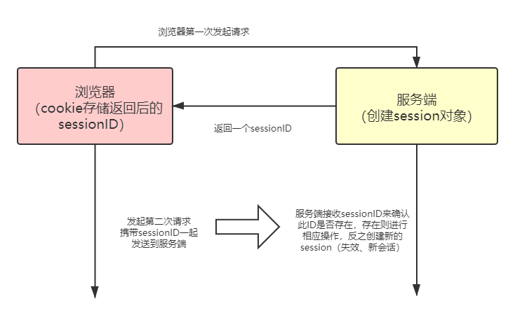

HTTP协议是一种无状态协议，即每次客户端向服务器发起请求时，都是一个全新的请求。服务器并不知道此时浏览器发起请求的历史记录。**session**和**cookie**的主要目的就是为了弥补HTPP的无状态特性。

### 什么是Cookie？

根绝[MDN](https://developer.mozilla.org/zh-CN/docs/Web/HTTP/Cookies)对cookie的官方解释：

```
HTTP Cookie(也叫WebCookie 或 浏览器 Cookie)是服务器发送到浏览器的一小块数据，它会在浏览器下次向同一服务器发起请求时被携带并发送到服务器上。通常，它用于告知服务器俩个请求是否来自同一个浏览器，如保持用户的登录状态。Cookie使基于无状态的HTTP协议记录稳定的状态信息成为可能。
```

cookie主要用于下面这个方面：

- **会话状态管理**：如用户登录状态，购物车，游戏分数或其他需要记录的信息；
- **个性化设置**：如用户自定义设置，主体等；
- **浏览器行为跟踪**：如跟踪分析用户行为等。

### 什么是Session？

session代表着客户端与服务器的一次会话过程。客户端向服务器发送请求时，服务器会为这一次请求开辟一块内存空间，这个对象就是session对象。它存储着特定用户会话所需的属性和配置信息，当用户在客户端中进行网页之间的跳转时，存储在session中的相关信息不会丢失，在整个会话中一直存在下去。当用户关闭浏览器或者session超时失效时会话才会结束会话。

### Cookie和Session有什么不同？

- **存储位置的不同**：cookie的数据信息存储在客户端（浏览器）上，session的数据信息存储在服务器上。
- **存储容量的不同**：单个cookie保存的数据<=4KB，session可存储的数据远高于cookie，但是session数据是保存在服务器上的，为了避免服务器负担过重，不应将将过多的数据存储在session对象中，并且设置session的删除机制。
- **有效期上的不同**：在开发环境中我们可以设置cookie的属性，使其达到长期有效的效果；session在服务器默认有效时间为30min，只要达到有效时间或者关闭窗口之后session就会失效，因此session并不能达到长期有效的效果。
- **存储方式的不同**：cookie只能存储ASCII（[**A**merican **S**tandard **C**ode for **I**nformation **I**nterchange](https://zh.wikipedia.org/wiki/ASCII)，美国信息交换标准码），并且需要通过编码转换为Unicode字符或者二进制数据进行存储；session能够存储任何类型的数据，包括但不仅限于 string，array，map等等。
- **隐私策略的不同**：cookie存储在客户端上，cookie是可见的，有坏心思的人会盗用cookie去做坏事（比如窃取用户信息），session数据存储在服务器上，对客户端来说是透明的，对敏感信息的安全性比cookie的要高。
- **跨域支持的不同**：cookie支持跨域名访问，session不支持跨域名访问。

### 为什么需要cookie和session，它们之间有什么关联？

众所周知，HTTP协议是无状态的，在浏览器我们并不知道是“罗云熙”还是“奥特曼”在于服务端进行交互，这时候就需要一种机制来告诉服务端，本次操作的用户是否已经登录，哪个用户正在执行操作，因此这套机制需要cookie和session的支持（配合）。

画一个简单的图来看一下浏览器和服务端（cookie和session）之间的关系：




浏览器在第一次请求服务端的时候，服务端会开辟一块新的内存空间创建session对象，根据用户的信息进行相应的数据存储。服务端返回数据给浏览器时会携带一个唯一的标识sessionID，浏览器把sessionID存储到cookie中，同时cookie记录此sessionID属于哪个域名。

只要浏览器对同一服务器再一次发起请求，请求会自动判断该域名下是否存在cookie信息，存在就会把对应的cookie信息发送到服务端，服务端会从cookie信息中获取sessionID。服务端根据这个sessionID去查找对应的session信息。如若sessionID在有效期内、会话继续中就可以进行后面的操作，否则说明用户登录已经失效或者说未登录。

根据以上流程可知，sessionID是连接cookie和session之间的一道桥梁，大部分系统也是根据此原理来验证用户是否登录

### 既然服务端是根据Cookie中的信息来判断用户是否登录，如若浏览器禁用了Cookie，如何保障整个机制的正常运转？

第一种方案：

```
通过添加一个SessionID的参数，在每次请求的时候都把该参数携带到服务端，可以拼接在URL上（xxxx/aa?SessionID=xxx），也可以添加到post请求参数体中（{SessionID：xxxx}）
```

第二种方案：

```
利用Token机制，Token机制多用于APP客户端与服务端进行交互，也可以用于Web端做用户状态的管理。
Token是“令牌”的意思，它是服务器生成的一段字符串指令，作为客户端请求的一个标识。当用户第一次登录时，服务端根据用户的请求信息生成token，响应时一并返回，以后的每一次请求都携带该token即可，无需再次登录验证。
```

### 如何考虑分布式Session问题？

**Session复制**

它是最初的解决方案，整体的大致流程为：假设现在有三台服务器，其中一台服务器创建一个session保存用户信息，则同时把这个session复制到其他俩台服务器。当用户不管请求哪台服务器都有对应的session信息。

他的优势在于服务器可以任意水平扩展，每个服务器都保留session信息，当加入一台新的服务器时，只需要把session信息复制过去即可。

劣势也是相当明显的，每个服务器上都保存session信息，服务器资源占用大；session同步需要占用带宽资源，如果是异步复制方式，数据会有短暂性的不一致，可能会导致用户访问失败。

**负载均衡方案**

Nginx ip_hash策略，服务器使用Nginx代理，将同一个IP的请求固定到同一台服务器上，这样来自同一个IP的session的请求总会请求到同样的服务器。

优势：

- 每台服务器只存储对应的session信息，大大节省了内存空间，而且服务器之间没有数据同步的过程。
- 当有新的服务器加入时，只需要修改负载均衡器的配置的即可，这样很方便服务器的水平扩展。

不足：

服务器重启意味着session信息的丢失，这在一些重要的业务场景中是不允许的。

服务器水平扩展需要修改负载均衡器的配置，修改之后可能会导致之前的session信息重新分配，这样会导致一部分用户路由不到正确的session。

**Session集中管理**

通过单独的服务器集群来存储和管理session数据，列如Redis，其他所有的应用服务器都需要从这个服务器集群获取对应session信息，从而实现session共享。

优点：

- 可靠性较高，通过单独的集群同一管理。
- 减少应用服务器的开销。

不足：

- 实现较为复杂，配置较多
- 需要维护单独的存储集群
- 受制于存储设备的依赖，如果存储设备down掉，就无法工作，要做好主备同步等容灾措施
- 但访问量过大时，磁盘的IO也是个非常大的问题


