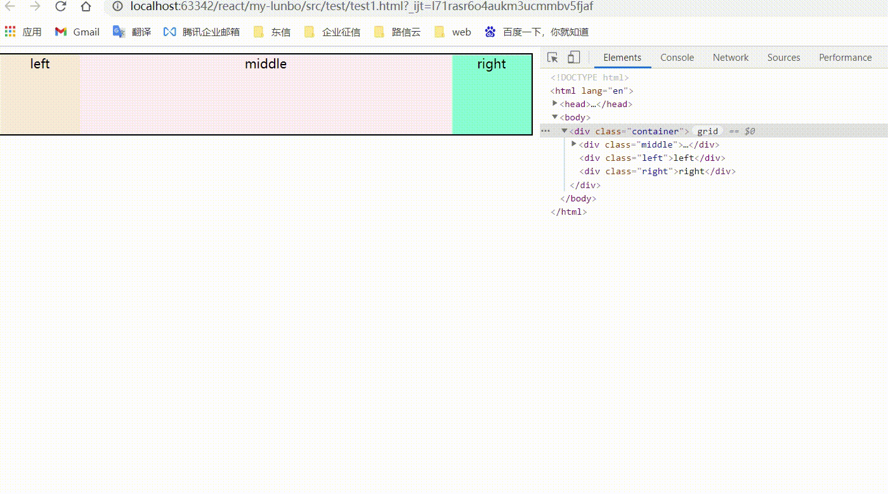

**圣杯布局**和**双飞翼布局**是经典的三栏布局，也是我们面试中的常客。俩者需要实现的效果都是俩边定宽，中间自适应。

**圣杯布局**

```
<div class="container">
  <div class="middle">middle</div>
  <div class="left">left</div>
  <div class="right">right</div>
</div>
```

**双飞翼布局**

```
<div class="container">
  <div class="middle">
    <div class="inner_middle">middle</div>
  </div>
  <div class="left">left</div>
  <div class="right">right</div>
</div>
```



#### 实现方式

**flex 方式（支持中间模块优先渲染）**

```
.container {
  border: 2px solid black;
  text-align: center;
  display: flex;
}

.left, .right, .middle {
  height: 100px;
}

.left, .right {
  width: 100px;
}  

.left {
  order: 1;
  background-color: antiquewhite;
}

.middle {
  width: 100%;
  order: 2;
  background-color: lavenderblush;
}

.right {
  order: 3;
  background-color: aquamarine;
}
```

**position + calc 方式（支持中间模块优先渲染）**

```
.container {
  text-align: center;
  position: relative;
  min-width: 300px;
}

.left, .right, .middle {
  height: 100px;
  position: absolute;
}

.left, .right {
  width: 100px;
} 

.left {
  left: 0;
  background-color: antiquewhite;
}

.middle {
  width: calc(100% - 200px);
  background-color: lavenderblush;
  left: 100px;
}

.right {
  right: 0;
  background-color: aquamarine;
}
```

**grid 方式（支持中间模块优先渲染）**

```
.container {
  text-align: center;
  min-width: 300px;
  display: grid;
  grid-template-columns: 100px auto 100px;
}

.middle {
  grid-column-start: 2;
  grid-column-end: 3;
  grid-row-start: 1;
  grid-row-end: 2;
  background-color: lavenderblush;
}

```

**float + calc 方式 （此时middle 放到了 最后面，不支持中间模块优先渲染）**

```
  .container {
    text-align: center;
    min-width: 300px;
    overflow: hidden;
  }

  .left, .right, .middle {
    height: 100px;
  }

  .left, .right {
    width: 100px;
  }
  
  .left {
    float: left;
    background-color: antiquewhite;
  }

  .middle {
    width: calc(100% - 200px);
    margin: 0 auto;
    background-color: lavenderblush;
  }
  
  .right {
    float: right;
    background-color: aquamarine;
  }
```

**table + table-cell 方式 （此时middle需放置到中间，不支持中间模块优先渲染）**

```
  .container {
    text-align: center;
    min-width: 300px;
    display: table;
    width: 100%;
  }

  .left, .right, .middle {
    height: 100px;
    display: table-cell;
  }

  .left, .right {
    width: 100px;
  }
```

**float + position 方式 （支持中间模块优先渲染）**

```
  .container {
    text-align: center;
    min-width: 300px;
    overflow: hidden;
    position: relative;
  }

  .left, .right {
    width: 100px;
  }
  
  .left {
    float: left;
    background-color: antiquewhite;
  }

  .middle {
    position: absolute;
    left: 100px;
    right: 100px;
    background-color: lavenderblush;
  }
  
  .right {
    float: right;
    background-color: aquamarine;
  }
```