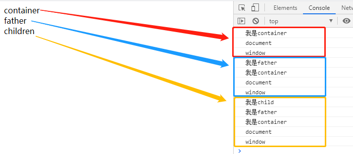
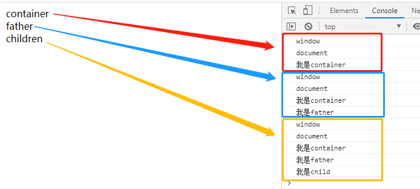

DOM事件流分为三个阶段：**捕获阶段、目标阶段、冒泡阶段**

捕获阶段：事件响应从最外层开始，由外而内直至目标元素。

目标阶段：触发事件响应的最内层元素（目标元素）。

冒泡阶段：与捕获阶段相反，事件响应从最内层开始，直至最外层。

在开发过程中，可以通过 **element.addEventListener(type,listener,useCapture||options  )** 中的第三个参数useCapture来设置事件模型为捕获还是冒泡。

type：监听的事件类型，注意：无需使用“on”前缀，“onclick”-->"click"；

listener：事件处理函数，当事件触发时所要处理的事情就敲代码在这里；

useCapture：为true时，事件模型为捕获。为false时，事件模型为冒泡，不传默认为false；

options：参考MDN官方解析：https://developer.mozilla.org/zh-CN/docs/Web/API/EventTarget/addEventListener

我们来看个例子：

```
<div class="container">
  container
  <div class="father">
    father
    <div class="children">
      children
    </div>
  </div>
</div>
```

```
<script>
  const container = document.querySelector(".container");
  const father = document.querySelector(".father");
  const child = document.querySelector(".children");

  window.addEventListener("click", () => {
    console.log(`window`)
  });
  document.addEventListener("click", () => {
    console.log(`document`)
  });
  container.addEventListener("click", () => {
    console.log(`我是container`)
  });
  father.addEventListener("click", (text) => {
    console.log(`我是father`)
  });
  child.addEventListener("click", (text) => {
    console.log(`我是child`)
  });
</script>
```

当我们依次点击：container、father、children，会进行事件冒泡。可以清楚的看到冒泡的执行顺序为：

**目标元素-->父级-->...-->document-->window**



当**addEventListener**的第三个参数传入true时，事件模型变为捕获，捕获的执行顺序与冒泡是相反的：

**window-->document-->...-->父级-->目标元素**



从以上代码我们可以看到，为每一个dom节点都绑定事件，显得很冗余，我们可以利用事件代理（事件委托）去简化代码。

**事件代理就是利用事件冒泡或捕获的机制把事件绑定提取到外层元素**

```
//代码简化如下
container.addEventListener("click", (e) => {
  console.log(e.target)
});
```

**需要注意：对于非目标阶段的元素，事件响应执行顺序遵循先捕获后冒泡得原则；当然也可以暂缓执行捕获事件，冒泡事件先行的效果**

例如通过定时器**setTimeout**暂缓捕获事件：

```
window.addEventListener("click", () => {
  setTimeout(() => {
    console.log(`window`)
  }, 0)
}, true);
document.addEventListener("click", () => {
  console.log(`document`)
});

输出：document-->window
```
