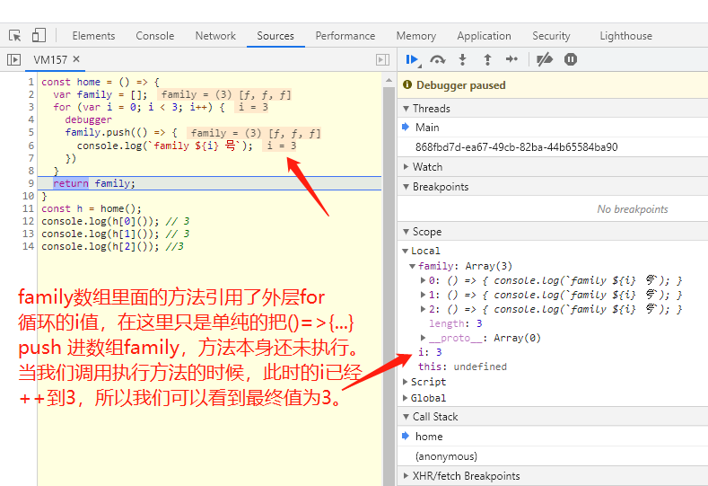

#### 什么是闭包？

包？作为女孩子，我可太喜欢包了，满满的购买欲（奈何囊中羞涩）。你问我什么叫闭包？打开淘宝搜索一下，看看这个所谓的“闭包”是个什么样子（搜索结果：您搜索的包包涉嫌违规，请注意您的行为），哼，就知道不是什么好包。可是为什么还会有人特意用它来撑场面呢？！

概念：当通过一个外部部函数调用内部函数的时候，外部函数执行结束之后，内部函数引用外部函数的变量仍然保留在内存当中，把这些变量的集合叫做闭包。

**简单的来说：函数A里面有个函数B，函数B引用了函数A的变量，那么函数B就可以叫做函数A的闭包。**

**闭包的构成：函数，以及创建该函数的环境**

**闭包的本质：闭包是JavaScript作用域的副产品**


```
const Father = () => {
  let count = 0;
  return () => {
    count++;
    console.log(count)
  }
}

const f1 = Father();
const f2 = Father();

f1(); // 1 引用count，加1
f1(); // 2 第一次执行的结果基础上再加 1
f2(); // 1 重新赋值新的Father函数，重新计数
```

一个包包肯定有好处跟坏处啦，毕竟包无完包@_@。

使用闭包可以帮我们把变量缓存起来不被GC回收，形成的私有方法有利于限制代码的访问，避免非核心的代码干扰到公共接口，利用闭包的特性实现柯里化（Currying）。

来个闭包产生问题🌰：

```
const home = () => {
  var family = [];
  for (var i = 0; i < 3; i++) {
    family.push(() => {
      console.log(`family ${i} 号`);
    })
  }
  return family;
}
const h = home();
console.log(h[0]()); // 3
console.log(h[1]()); // 3
console.log(h[2]()); //3
```

预期结果是输出：0号，1号，2号，最终控制台打印出的结果都是3号。在这里我们可以debugger看看每一步的 i 值变化。



利用闭包实现柯里化，实现一个add方法，满足：addFunc(1)(2)(3)，addFunc(1)(2,4)(6)

```
/*
*  arg :第一次调用的参数
* */
const addFunc = function(...arg) {
   // 不使用剩余参数表示法，可以使用如下方法
   // const _newArr = Array.from(arguments)
   // 添加剩余的参数进来，不能使用（）=>{},它没有自己的arguments
   const counter = function() {
    // _newArr.push(...arguments)
    arg.push(...arguments);
    return counter;
   };
  // 重写toString方法，console.log()会调用这个对象的toString方法
  counter.toString = ()=>{
    // _newAr.reduce((v1, v2)=>v1 + v2);
    return arg.reduce((v1, v2)=>v1 + v2);
  };
    return counter;
};
```

这里一篇个人很喜欢的文章：
作者：王仕军
链接：https://juejin.cn/post/6844903474212143117