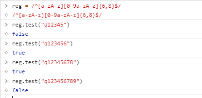
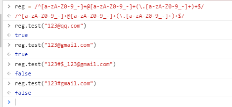
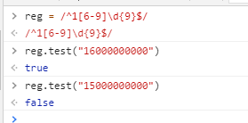
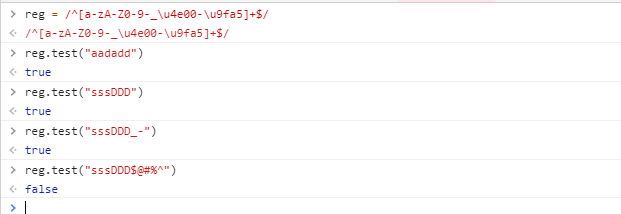
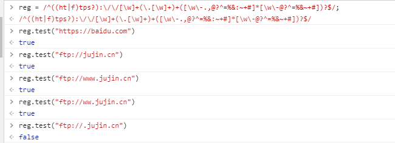
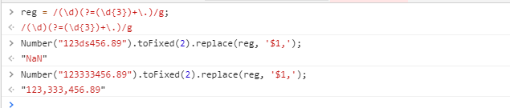
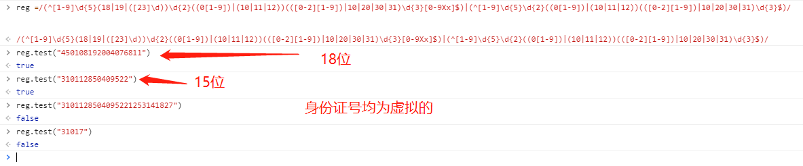
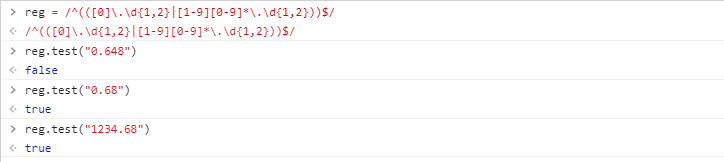

**请输入n到m位由字母开头和数字组成的新密码**

```	
/^[a-zA-z][0-9a-zA-z]{n,m-1}$/ //（-1是因为开头字母不算在范围内）,下图是6~9位
```



**邮箱验证规则**

```
/^[a-zA-Z0-9_-]+@[a-zA-Z0-9_-]+(\.[a-zA-Z0-9_-]+)+$/
```



**手机号码格式验证规则，在n-m之间符合**

```
/^1[n-m]\d{9}$/
```



**名字只支持数字/大小写字母/中文/-_**

```
/^[a-zA-Z0-9-_\u4e00-\u9fa5]+$/
```




**匹配URL**

```
/^((ht|f)tps?):\/\/[\w]+(\.[\w]+)+([\w\-.,@?^=%&:~+#]*[\w\-@?^=%&~+#])?$/
```



**数字千位符分割**

```
/(\d)(?=(\d{3})+\.)/g
```



**身份证号校验，15位，18位**

```
18位:/(^[1-9]\d{5}(18|19|([23]\d))\d{2}((0[1-9])|(10|11|12))(([0-2][1-9])|10|20|30|31)\d{3}[0-9Xx]$)
15位:(^[1-9]\d{5}\d{2}((0[1-9])|(10|11|12))(([0-2][1-9])|10|20|30|31)\d{3}$)/
```



**输入数字且不大于两位小数**

```
 /^(([0]\.\d{1,2}|[1-9][0-9]*\.\d{1,2}))$/
```

