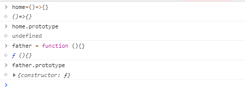
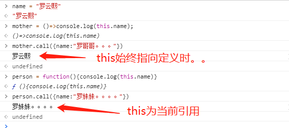
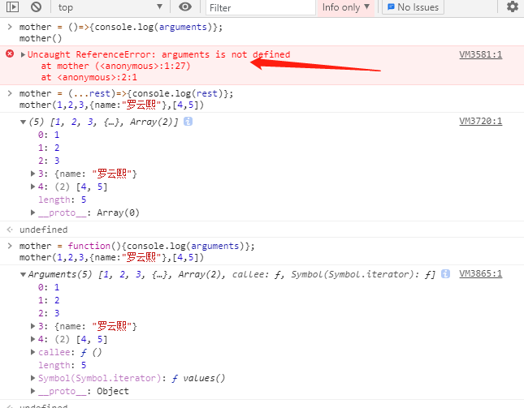

### **箭头函数的语法更加简洁、清晰**

```
// 普通函数
const home = function(x, y) {
  return x * y;
};
//箭头函数
const home = (x, y) => x * y;
```

### **箭头函数在[MDN](https://developer.mozilla.org/zh-CN/docs/Web/JavaScript/Reference/Functions/Arrow_functions)对this的解释为：它不会拥有自己的this，他只会从自己的作用域链的上一层继承this**

```
箭头函数会捕获其坐在上下文的this值，并将它作为自己的this值，定义的时候就确定并固定下来，以后就不会改变。
```

### 箭头函数没有原型prototype



### 箭头函数不能作为构造函数使用，也不能用new关键字

```
它没有自己的this，它的this其实是继承外层执行环境中的this，且this指向永远不会改变，然后作为构造函数其this值是要指向创建的对象
```

### call、apply、bind无法改变箭头函数中的指向



### 箭头函数不绑定arguments，用rest参数来替代arguments。



### **箭头函数不能用作Generator函数，不能使用yield关键字**